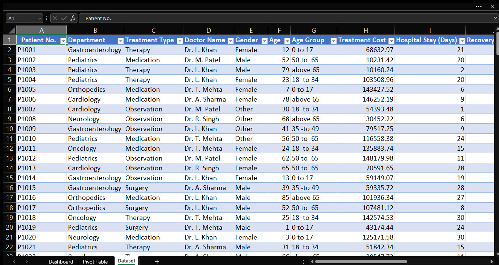
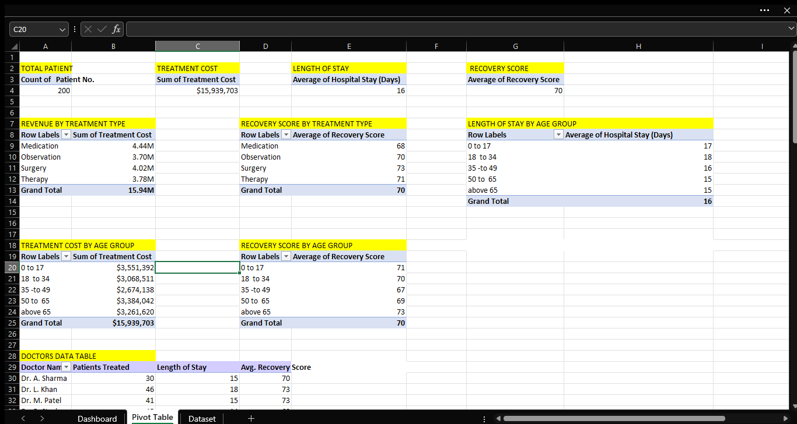
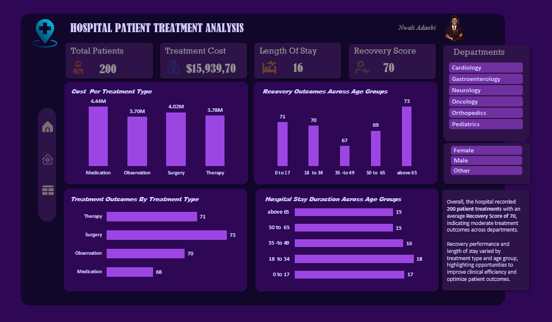
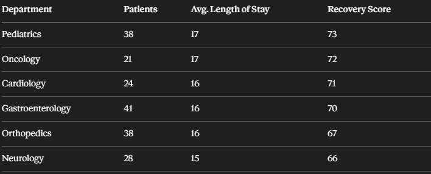
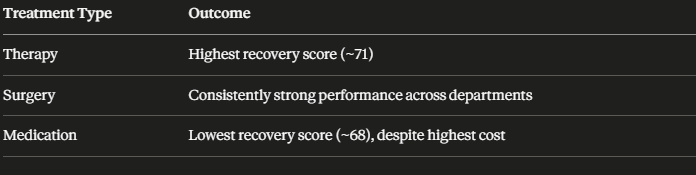
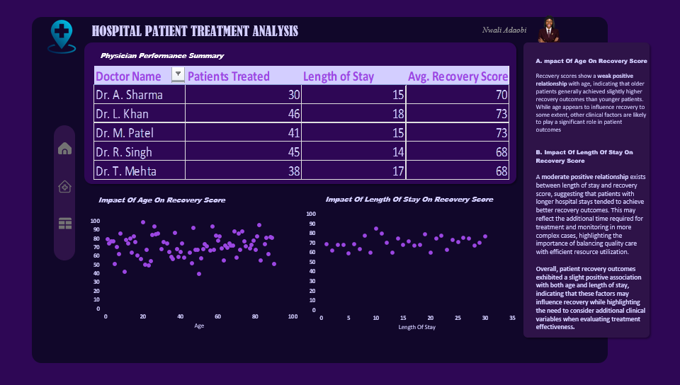

# UNCOVERING-TRENDS-AND-PATTERNS-HOSPITAL-PATIENT-TREATMENT-ANALYSIS

## Introduction
Hospitals generate large volumes of patient data every day, including information on admissions, diagnoses, treatment methods, recovery outcomes, treatment costs, and length of hospital stay. Analyzing this data helps healthcare providers evaluate the effectiveness of clinical interventions, optimize resource utilization, improve patient outcomes, and make informed operational decisions.

Hospital patient treatment analysis focuses on examining key healthcare metrics to understand how different factors—such as treatment type, patient demographics, age groups, departments, and duration of hospitalization—influence recovery outcomes. By identifying trends and performance gaps, hospitals can implement evidence-based strategies to enhance quality of care, reduce unnecessary costs, and improve overall healthcare delivery.

This report provides insights into patient treatment performance by analyzing recovery scores, treatment costs, length of stay, and departmental outcomes. The findings are intended to support hospital management in identifying strengths, addressing operational challenges, and improving patient-centered care.

## Problem Statement
Hospitals continually strive to deliver high-quality healthcare while managing operational costs and improving patient outcomes. However, several challenges can hinder effective decision-making, including variations in treatment effectiveness across departments, increasing treatment costs, prolonged hospital stays, inconsistent patient recovery rates, and incomplete patient records.

Consequently, there is a need for a comprehensive hospital patient treatment analysis that transforms raw healthcare data into actionable insights. Such analysis enables hospital management to make data-driven decisions that improve clinical outcomes, enhance operational efficiency, reduce healthcare costs, and support continuous quality improvement.

## Data Sourcing
The dataset is a public-made dataset available on Kaggle for practical purpose, containing 200 patient records.
The key fields include;
  - Patient Code
  - Department 
  - Treatment Type
  - Doctor Name
  - Gender
  - Age
  - Treatment Cost
  - Hospital Stay
  - Recovery Score

## Data Cleaning & Transformation
Prior to analysis, the raw dataset was cleaned and prepared in Microsoft Excel to ensure accuracy and consistency, following these steps:

1. **Data Backup**: A backup copy of the raw dataset was created to preserve the original data before any modifications were made.
2. **Descriptive Statistics**: Descriptive statistics were run on Treatment Cost, Length of Stay, and Recovery Score as an initial step to identify potential outliers and understand the underlying data distribution.
3. **Age Group Categorization**: An Age Group field was created using the IF function to segment patients into defined age brackets, enabling more meaningful comparisons across other variables.
4. **Pivot Table Analysis**: Pivot tables were built to answer the key analytical questions driving this report.
5. **Dashboard Development**: Interactive dashboards were developed to visualize the findings and support clear, data-driven decision-making.

## Key Metrics
1. **Total Patients**: The total number of patients treated by the hospital during the reporting period.
2. **Total Treatment Cost"": The total revenue generated by the hospital from patient treatments during the reporting period.
3. **Average Length of Stay**: The average number of days patients were hospitalized per admission.
4. **Average Recovery Score**: The average percentage reflecting patients' degree of recovery following treatment at the hospital.

## Insights & Findings
This analysis examines outcomes across 200 patients treated at the hospital, with a gender distribution of 57 females (28.5%), 81 males (40.5%), and 62 records with unspecified gender (31.0%).
  - Total Patients: 200
  - Total Treatment Cost: $15,929.70
  - Average Length of Stay: 16 days
  - Average Recovery Score: 70/100

The hospital achieved a moderate overall recovery outcome of 70%, with patients averaging a 16-day length of stay. Recovery performance showed meaningful variation across treatment types, age groups, and departments, pointing to specific opportunities for targeted improvement.

**Data Quality Flag**: 31% of patient records (62 of 200) have unspecified gender. This is a significant gap that should be addressed, as it limits the reliability of any demographic-based analysis and recommendations.

**Treatment Spend vs. Outcomes**: Medication accounted for the highest treatment revenue ($4.44M) but delivered the lowest recovery score (68).  Conversely, Therapy generated the lowest revenue ($3.78M) yet achieved the highest recovery score (71). This indicates that higher treatment expenditure does not necessarily correlate with better patient outcomes — a finding worth further investigation into treatment protocols and resource allocation.

**Age-Related Outcomes**: Patients aged 65+ recorded the highest recovery score (~78), while those aged 35–49 recorded the lowest. This gap may reflect more intensive monitoring and follow-up care typically extended to older patients, and suggests an opportunity to extend similar care intensity to the middle-aged cohort.

**Departmental Performance**

Pediatrics and Oncology lead in recovery outcomes, while Neurology and Orthopedics trail the hospital average — both may warrant a closer review of care protocols.

**Treatment Effectiveness**

Therapy emerged as the most effective treatment approach, achieving the highest average recovery score of approximately 71, despite generating the lowest treatment revenue (~$3.78 million) among the three categories. This suggests that therapy-based interventions may offer strong clinical value relative to their cost.

Medication, by contrast, generated the highest treatment revenue (~$4.44 million) but recorded the lowest average recovery score of approximately 68. This inverse relationship between spend and outcome is a key finding of this analysis, indicating that higher expenditure on medication-based treatment does not necessarily translate into better patient recovery.

Surgery demonstrated consistently strong performance across several departments, positioning it as a reliable treatment option, though it did not lead in either revenue or recovery score.

Taken together, these findings suggest that treatment effectiveness is not solely a function of cost. The hospital may benefit from a closer review of Medication protocols to understand the drivers behind its comparatively lower recovery outcomes, while examining what aspects of Therapy's approach are contributing to its stronger results—potentially informing improvements across other treatment types.

The physician performance analysis reveals noticeable variations in patient outcomes and care efficiency. Dr. L. Khan and Dr. M. Patel achieved the highest average recovery scores (73), demonstrating strong clinical effectiveness, while Dr. R. Singh and Dr. T. Mehta recorded the lowest recovery scores (68). Although Dr. L. Khan managed the highest patient volume (46), the physician maintained excellent recovery outcomes, suggesting effective treatment practices. These differences indicate opportunities to benchmark high-performing physicians and standardize best practices across the clinical team.

The scatter plot indicates a weak positive relationship between patient age and recovery score, meaning recovery outcomes improve slightly with increasing age. However, the wide distribution of data points shows that age alone has minimal influence on treatment success. This suggests that other clinical factors—such as disease severity, treatment type, underlying health conditions, and quality of care—are more significant determinants of patient recovery than age.

The analysis shows a moderate positive relationship between length of hospital stay and recovery score, indicating that patients who remained hospitalized for longer periods generally achieved better recovery outcomes. This trend suggests that extended stays may allow for more comprehensive treatment, monitoring, and rehabilitation, particularly for complex cases. However, the variation in the data also indicates that prolonged hospitalization does not guarantee better recovery, emphasizing the need to optimize the length of stay to balance clinical outcomes with efficient resource utilization.

## Recommendations
1. Investigate and resolve the gender-data gap (31% unspecified) to strengthen future demographic reporting.
2. Review Medication protocols given the cost-outcome mismatch.
3. Assess whether Neurology and Orthopedics need additional clinical or staffing support.
4. Consider extending enhanced follow-up care models (used for 65+ patients) to the 35–49 age group.
5. Strengthen rehabilitation and follow-up programs.
6. Use predictive analytics to identify patients at risk of poor recovery outcomes.

## Conclusion
This analysis demonstrates the value of healthcare data analytics in supporting evidence-based decision-making within the hospital. By evaluating patient demographics, treatment costs, length of stay, recovery scores, treatment types, and departmental performance, the hospital gains a comprehensive understanding of the factors influencing patient outcomes and operational efficiency.

Overall, these insights can help the hospital improve the quality of patient care, optimize resource utilization, reduce unnecessary costs, enhance recovery outcomes, and support strategic planning for continuous healthcare improvement.

To enable deeper and more accurate analysis in future studies, the hospital should consider collecting additional clinical and operational data, including:
  - Patient Diagnosis and Disease Severity: To understand how specific medical conditions influence recovery and treatment outcomes. 
  - Comorbidities: Information on chronic illnesses such as diabetes, hypertension, or heart disease to explain variations in recovery. 
  - Readmission Rates: To evaluate the long-term effectiveness of treatments and identify recurring health issues. 
  - Treatment Duration and Follow-up Data: To assess the impact of post-discharge care on patient recovery. 
  - Patient Satisfaction Scores: To complement clinical outcomes with patient experience and service quality. 
  - Mortality and Complication Rates: To provide a more comprehensive assessment of treatment quality and patient safety. 
  - Data Quality Improvements: Ensure complete and accurate recording of patient information, particularly demographic details such as gender, to improve the reliability of future analyses.
    
By expanding the dataset and integrating advanced analytical techniques, the hospital can move beyond descriptive reporting to predictive and prescriptive analytics. This will enable hospital management to anticipate healthcare challenges, optimize clinical decision-making, improve patient outcomes, and strengthen overall operational performance.

## Author
**Nwali Adaobi** (Healthcare | BI Analyst)

